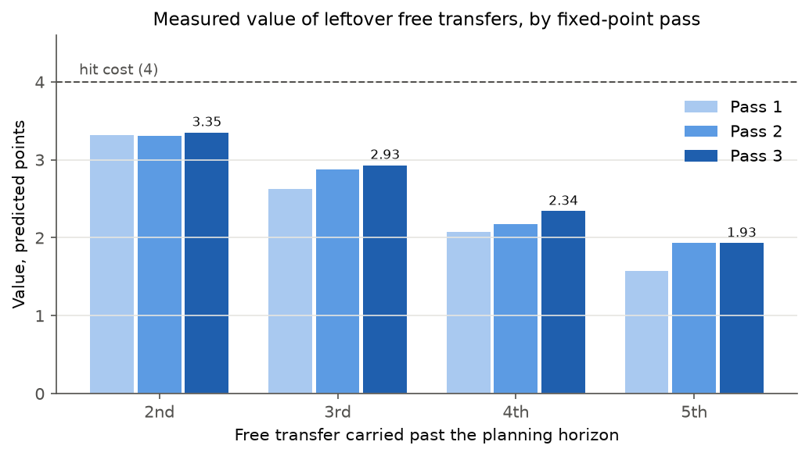

# Optimiser

The optimiser decides what to do: which players to buy and sell, who starts, who captains. It plans **five
gameweeks at once** as a single integer linear program (a mathematical model whose decisions are yes/no or whole
numbers, solved to a proven optimum). It acts on the first week and re-plans the following week with new data.

Code: `optimisation/model.py` (`solve_plan`), `optimisation/validate.py` (independent checker),
`optimisation/cli.py`. Shipped settings: `optimisation/plan_params.json`.

## Why plan several weeks

Planned one week at a time, the predictions cannot answer the questions that decide a season: whether to buy a
player a week before his team plays twice, whether to save a free transfer because a better use is coming, whether
a 4-point hit pays back over several weeks rather than one. A multi-week plan sees these directly.

The later weeks are a plan, not a commitment. Only week one's decisions are carried out; next week the whole plan
is solved again. This is called a rolling horizon.

## The model

Expected points `p[i,t]` for every player `i` and planned week `t = 1..H` come from the
[prediction model](prediction-model.md). The optimiser treats them as plain numbers.

### Decisions

For each player and week, all yes/no: in the squad `x[i,t]`, in the starting XI `y[i,t]`, captain `c[i,t]`,
bought `b[i,t]`, sold `s[i,t]`. For each week: money in the bank `m[t]`, free transfers available `f[t]`, free
transfers used `u[t]`, hits taken `h[t]`.

### Rules

**Squad carry-over.** This week's squad is last week's plus purchases minus sales, starting from the current squad:

```
x[i,t] = x[i,t-1] + b[i,t] - s[i,t],      b[i,t] + s[i,t] <= 1
```

**Bank.** Money moves with every sale and purchase and can never go negative:

```
m[t] = m[t-1] + sum_i sell_i * s[i,t] - sum_i price_i * b[i,t],      m[t] >= 0
```

`sell_i` is a currently owned player's selling price (FPL keeps half of any price rise, rounded down) and
`price_i` is today's price for anyone else. Prices are held at today's values for the whole plan; they are
refreshed at every re-plan. A player owned today may be sold at most once in the plan.

**Transfers and hits.** With `n[t]` the number of players bought in week `t`:

```
u[t] = min(f[t], n[t]),      h[t] = n[t] - u[t],      h[t] <= 2
```

The minimum is enforced exactly with one extra yes/no variable per week. At most two hits a week (shipped setting).

**Free-transfer rollover.** FPL adds one free transfer a week, up to a cap of five:

```
f[t+1] = min(5, f[t] - u[t] + 1)
```

A minimum is not linear, so it is written as two upper bounds, `f[t+1] <= f[t] - u[t] + 1` and `f[t+1] <= 5`; the
solver always takes the largest allowed value, because more free transfers can only help. The reported values are
recomputed from FPL's exact rule after the solve and re-checked by the validator.

**Every week**, the standard FPL rules apply: 15 players (2 goalkeepers, 5 defenders, 5 midfielders,
3 forwards), at most three from one club, 11 starters in a valid formation, one captain who starts. The limits are
read from FPL's own data.

From scratch (no current squad), the same model starts from an empty squad with a £100m budget and unlimited free
transfers in week one.

### Objective

Maximise

```
sum over weeks t of  gamma^(t-1) * [ sum_i p[i,t] * (y[i,t] + c[i,t] + w * (x[i,t] - y[i,t]))  -  4 * h[t] ]
  +  gamma^H * sum_k Delta_k * z_k
```

- A starter counts once, the captain twice, a bench player at weight `w` (shipped: 0.1). The bench weight is small
  because bench points only count when a starter does not play.
- `gamma` is the discount on later weeks (shipped: 0.7).
- `Delta_k * z_k` is the value of free transfers left over after the last planned week (below).
- A tiny penalty on each purchase stops the model making a transfer that gains nothing.

With `H = 1` this is exactly the earlier single-week optimiser, whose tests still run as regression tests.

### Why discount later weeks

Every gameweek's points count the same in FPL, so the discount is not a preference for points now. It corrects two
biases of planning on point estimates:

1. **Selection bias.** The solver picks the best of many noisy estimates, so the options it picks are
   disproportionately the over-estimated ones. Predictions further ahead are noisier (rank correlation falls from 0.543
   for the next gameweek to 0.431 five weeks ahead), so the bias grows with distance.
2. **Plan revision.** A move planned for week four often never happens, because the plan is re-solved every week.

Both are empirical, so `gamma` was chosen by replaying past seasons ([validation](validation.md)) from 0.7, 0.8,
0.9 and 1.0. The replay picked 0.7, but the differences between settings were within the replay's noise.

## The value of leftover free transfers

Without a value on free transfers left after the last planned week, the model would spend them all in week five on
any small gain, which distorts the weeks before it. Inside the horizon no such value is needed: if saving a
transfer for week three is worth more than using it now, the model sees that directly.

The value is measured, not guessed. Let `W(f)` be the model's best objective from a replayed position when it starts
with `f` free transfers. One more free transfer is worth

```
Delta(f) = W(f + 1) - W(f),    f = 1..4
```

averaged over a sample of replayed gameweeks (every fourth one). The table is capped just below the hit cost and
kept non-increasing, so the model can never profit from taking a hit to bank a transfer. In the objective,
`z_k = 1` for each extra free transfer still in hand after week `H` (so `sum_k z_k <= f[H+1] - 1`), and because the
table decreases, no ordering constraints are needed.

**It refers to itself.** `W` contains the leftover value being measured: a free transfer the plan does not use is
itself valued by the table. The measurement is therefore repeated: start from zero, measure, put the table into the
model, measure again (a form of value iteration from dynamic programming). The discount damps this feedback, since
the leftover term is multiplied by `gamma^H`; the table was measured at a discount of 0.9.

| Pass | 2nd free transfer | 3rd | 4th | 5th |
|---|---|---|---|---|
| 1 | 3.32 | 2.63 | 2.07 | 1.57 |
| 2 | 3.31 | 2.88 | 2.17 | 1.93 |
| 3 | 3.35 | 2.93 | 2.34 | 1.93 |



The values had not settled to the target tolerance of 0.05 within the three passes allowed: from pass 2 to pass 3
they moved by up to 0.17. Pass 3 is the shipped table.

The table is in predicted points, which the selection bias above inflates, so the replay also tried it at half and
zero strength. On real points over four seasons, full strength scored 8,740, half 8,635 and zero 8,443, and three
of the four leave-one-season-out folds chose full strength.

## Chips as what-ifs

The caller may name one chip per week (`--chip NAME:GW`, for example `--chip bboost:12`); the model applies it but
does not choose when to play it. Chip timing is left to the reasoning layer.

| Chip | Name | Effect in the model |
|---|---|---|
| Bench Boost | `bboost` | the bench counts in full that week |
| Triple Captain | `3xc` | the captain counts three times |
| Wildcard | `wildcard` | unlimited free transfers that week, no hits; banked free transfers are kept and none is added |
| Free Hit | `freehit` | a separate one-week squad with unlimited free transfers; the regular squad and bank return the week after |

For the Free Hit, the budget is the bank plus the regular squad's selling value, and an owned player kept in the
Free Hit squad counts at his selling price. Whether a chip is available is checked from the manager's history
before solving.

## Solver and speed

The model is solved with HiGHS, through PuLP, to a proven optimum (no early stopping, single-threaded). On the
project owner's real squad with 562 players, a five-week plan takes about 47 to 50 seconds and a one-week plan under
a second. The full season replay and tuning run (146 gameweeks for each of 15 settings, plus the leftover-transfer
measurement) took 5.2 hours on 16 parallel processes.

## How it is checked

The rules are the correctness backbone of the project, so they are checked in three independent ways.

- **Independent validator.** `optimisation/validate.py` re-checks every planned week and every transition between
  weeks (squad carry-over, bank, free transfers, hits, chips) in plain Python, without the solver. It runs after
  every solve in the tests, in every replayed gameweek and live; the extra solves that measure the leftover-transfer
  table are not validated.
- **Brute force on a small game.** On a scaled-down game (10 players, small squads), every possible plan over two
  and three weeks is enumerated to find the best one. The optimiser's objective must match it exactly,
  across 30 random cases with transfers (random free transfers, bank, hit limit, discount, hit margin, leftover
  values and chips), 8 cases starting before gameweek 1 (unlimited free transfers in the first week), and 10
  from-scratch cases drawn, of which 9 have a legal squad.
- **Known answers.** Hand-built cases with obvious correct answers: a transfer held for the week it gains most,
  waiting for a free transfer when a hit does not pay over the horizon, a hit taken when it does, a selling price
  limiting a later week's budget, each chip's effect, the squad returning after a Free Hit.

HiGHS and the CBC solver are also run on the same instance in the tests and must reach the same optimum.

## Live use

```bash
python -m optimisation.cli --entry 1234567                  # this week's moves plus a provisional plan
python -m optimisation.cli --entry 1234567 --horizon 3      # plan three weeks instead of five
python -m optimisation.cli --entry 1234567 --discount 0.9   # override the shipped discount
python -m optimisation.cli --entry 1234567 --chip bboost:12 # what-if: Bench Boost in gameweek 12
```

The output lists this week's transfers, XI, bench and captain, then one line per later week with its planned
transfers, captain and expected points, marked provisional. A run with `--entry` and the component scorer before
a deadline is recorded in `plan_log` (the latest record per gameweek and team is kept), for the forward test. Settings come from `optimisation/plan_params.json`,
or from `data/processed/plan_params.json` after a local re-tune.

## Not modelled

- Price changes within the plan (FPL does not publish its price algorithm).
- Uncertainty beyond the discount: the plan uses expected points and does not value flexibility directly. A
  scenario-based model is a possible successor.
- When to play chips.
