# Overview

FPL AI Coach recommends Fantasy Premier League transfers, a starting XI and a captain for the coming gameweek,
with the reasoning behind them. It is a personal portfolio project, built in stages, each one runnable end to end
before the next begins.

This page describes the system as a whole. The other methodology pages go into each part:

- [Prediction model](prediction-model.md): expected points per player for the next five gameweeks.
- [Optimiser](optimiser.md): the integer program that plans transfers, team and captain over five gameweeks.
- [Validation](validation.md): how the predictions and the plans were tested on past seasons, and what the tests
  can and cannot show.

## Five layers

The system is split into five layers, each with one job. Only clean, structured tables cross from one layer to the
next, so each layer can be tested on its own.

1. **Ingestion** pulls the state of the game: players, prices, fixtures and results from the official FPL API, a
   manager's history, chips and transfers, and an archive of past seasons for testing.
2. **Feature engineering** turns match history into inputs for the model: attack and defence ratings for every
   team, and each player's chance of playing and per-90-minute rates. Every feature is computed from matches before
   a cutoff time only, so a past gameweek can be replayed using only data from before its deadline.
3. **Prediction** turns those features into expected FPL points per player for each of the next five gameweeks,
   through FPL's own scoring rules.
4. **Optimisation** chooses the squad, transfers, starting XI and captain that maximise expected points over the
   next five gameweeks, subject to every FPL rule (budget, squad shape, club limit, formation, free transfers and
   hits). It knows nothing about how the predictions were made: it receives a table of numbers.
5. **Reasoning** (planned) will use a large language model to read injury news, review the optimiser's plan, advise
   on chip timing and write the final recommendation, calling the optimiser as a tool to test alternatives.

## The weekly cycle

```mermaid
flowchart TD
    subgraph Layers
        I["1. Ingestion<br/>FPL API, manager state, past-season archive"]
        F["2. Features<br/>team ratings, minutes, per-90 rates"]
        P["3. Prediction<br/>expected points, next 5 gameweeks"]
        O["4. Optimisation<br/>5-week integer program"]
        R["5. Reasoning (planned)<br/>news, review, chips, write-up"]
        I --> F --> P --> O --> R
    end

    subgraph Weekly["Each gameweek"]
        W1["Pull fresh data"] --> W2["Predict the next 5 gameweeks"]
        W2 --> W3["Plan transfers, XI and captain for all 5"]
        W3 --> W4["Act on week one only"]
        W4 --> W5["Gameweek is played"]
        W5 -->|"re-plan with new data"| W1
    end
```

The later weeks of each plan are provisional. Their purpose is to put the right value on this week's decision:
whether to make a transfer now or save it, whether a hit pays back over several weeks, whether to buy a player a
week before his team plays twice. The whole plan is solved again the following week with new data.

## What exists today

| Stage | Status | What it provides |
|---|---|---|
| 1. Ingestion skeleton | Built | FPL API client, raw snapshots and tidy tables; reconstructed free transfers, chips and selling prices for any public team |
| 2. Optimiser on current stats | Built | Single-week integer program with an independent rule checker |
| 3a. Prediction model | Built | Component model of expected points, walk-forward backtest, tuned parameters |
| 3b. Multi-week optimiser | Built | Five-week plan, chips as what-ifs, season replay and tuned planning settings |
| 4. Screenshot parsing | Planned | Read a squad from a screenshot of the FPL app |
| 5. Machine-learning prediction | Planned | Gradient-boosted model, validated walk-forward against the component model |
| 6. Reasoning layer | Planned | News to risk flags, plan review, chip timing, written recommendation |
| 7. Presentation | Planned | Dashboard |

Today the pipeline runs from the command line: `python -m optimisation.cli --entry <your team ID>` refreshes the
data if needed, predicts five gameweeks, and prints this week's transfers, XI, bench and captain followed by the
provisional plan for the next four weeks.

Not yet covered: injury and team news beyond FPL's own "chance of playing" flag, chip timing (the optimiser applies
a chip when asked but does not choose when to play it), and price changes over the planning horizon.
