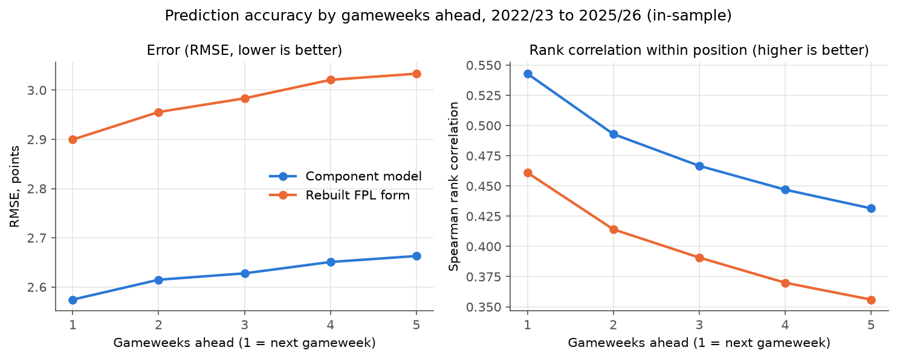
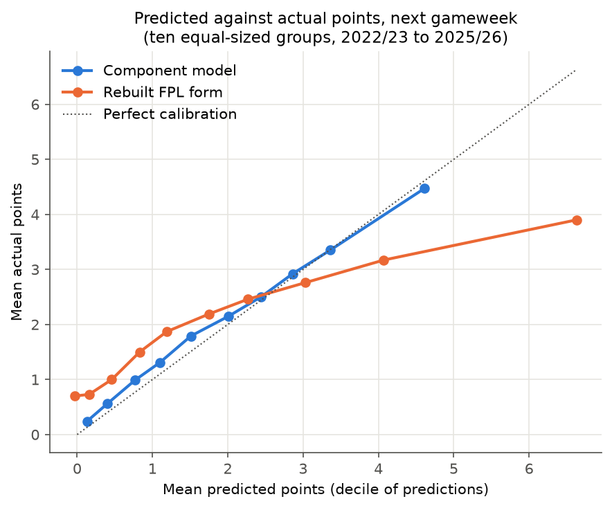

# Prediction model

The prediction layer estimates **expected FPL points for every player, in each of the next five gameweeks**. It is
a component model: rather than learning points directly, it estimates the ingredients of a score (minutes, goals,
assists, clean sheets and so on) and combines them through FPL's own scoring rules. A gameweek in which a team
plays twice adds both fixtures; a gameweek with no fixture scores zero.

Code: `features/team_ratings.py`, `features/player_rates.py`, `prediction/component_model.py`,
`prediction/scoring.py`. Shipped parameters: `prediction/model_params.json`.

## One timeline rule

Every feature is computed from matches that kicked off before a cutoff time, and nothing after it. Live
predictions use "now"; the backtest uses each past gameweek's first kickoff. Both run the same code, and a test
checks that adding made-up future matches never changes a prediction.

## Team ratings

Each team has an attack rating `a` and a defence rating `d`. For a match where team H hosts team A, the expected
goals of each side are

```
lambda_H = exp(mu + home + a_H - d_A)
lambda_A = exp(mu        + a_A - d_H)
```

with `mu` the league's baseline scoring rate and `home` the home advantage. The ratings are fitted by weighted
Poisson maximum likelihood to a blend of expected goals (xG) and real goals: `0.5 * xG + 0.5 * goals`. xG is a
steadier measure of chance quality than goals; goals keep the ratings tied to what actually happened.

- **Recency.** A match's weight halves every 120 days, and matches from earlier seasons are multiplied by a further
  0.25 per season back.
- **Shrinkage.** A ridge penalty pulls every rating towards a prior: zero for most teams, and for promoted teams a
  weaker prior (attack -0.15, defence -0.3), since newly promoted sides usually start below the league average.

## Minutes

Playing time dominates FPL scoring: a player earns 2 points for playing 60 minutes or more and 1 for a shorter
appearance, and every other component scales with time on the pitch. The model estimates, for each player:

- `p60`: the chance he plays 60 minutes or more,
- `psub`: the chance he plays less than 60 minutes,
- `m60`, `msub`: his typical minutes in each case.

Each is a recency-weighted average of his past matches, shrunk towards the average for players in his position
and price band (below £5.5m, £5.5m to £7.5m, £7.5m to £10m, above £10m):

```
shrunk = (sum of weighted observations + kappa * prior) / (sum of weights + kappa)
```

`kappa` sets how much evidence is needed to move away from the prior; for the minutes probabilities it is small
(0.1), so a player's own record dominates quickly.

### Short and long memory

How far back should a player's record count? For next gameweek, a short memory is best: the last match is the best
signal of an injury or a change in role. For a fixture four weeks away, a longer memory is better. The data show
why. Across 1,111 player-seasons in the archive, the correlation between "played 60 minutes or more" in two
matches, after removing each player's own average, is:

| Matches apart | 1 | 2 | 3 | 4 | 5 |
|---|---|---|---|---|---|
| Correlation | 0.41 | 0.27 | 0.17 | 0.10 | 0.06 |

If only the last match mattered, these would fall as 0.41, 0.17, 0.07. They fall much more slowly after the first
step: the pattern of a persistent underlying role with one-off noise on top. A single rest or early substitution
says little about next month.

So `p60` and `psub` are each computed twice, with a short memory (weights halve every 5 days) and a long memory
(weights halve every 60 days), and blended per fixture:

```
m(d) = v(d) * m_short + (1 - v(d)) * m_long,   v(d) = 0.5 ^ (d / 14)
```

where `d` is the number of days from the deadline to the fixture. A match this weekend leans on the short memory;
one five weeks out leans mostly on the long one.

**Availability.** Live predictions also use FPL's "chance of playing" flag `c` (for example 75% for a doubtful
player). The next gameweek's `p60` and `psub` are multiplied by `c`, and the shortfall from 100% halves for each week
further ahead. The
archive holds no historical flags, so the backtest runs without them.

## Per-90 rates

Each player's rates per 90 minutes are recency-weighted (weights halve every 30 days; previous seasons count 0.75
per season back) and shrunk towards the average for his position and price band, with `kappa` set per rate
(xG 8, xA 2, bonus 6, saves 12, defensive contribution 2, cards 10).

Attacking rates are stored relative to his team's expected goals in the matches where they were earned, then
multiplied back by his current team's expected goals in each fixture. A player who moves to a stronger attack, or
faces a weak defence, gains expected goals accordingly.

## Components

For player *i* in one fixture, with his team's expected goals `lambda_T`, the opponent's `lambda_O` and expected
minutes `E[m] = p60 * m60 + psub * msub`:

| Component | Expected points |
|---|---|
| Appearance | `2 * p60 + 1 * psub` |
| Goals | `points per goal (by position) * xG rate * lambda_T * E[m] / 90` |
| Assists | `3 * xA rate * lambda_T * E[m] / 90` |
| Clean sheet | `clean-sheet points (by position) * p60 * exp(-lambda_O)` |
| Goals conceded | `-p60 * E[floor(G / 2)]`, `G ~ Poisson(lambda_O)` (goalkeepers, defenders) |
| Saves | `p60 * E[floor(S / 3)]`, saves `S` Poisson (goalkeepers) |
| Bonus | bonus per 90 * `E[m] / 90` |
| Defensive contribution | `2 * p60 * chance of reaching the threshold` (from 2025/26 only) |
| Discipline | `-(1 * yellow rate + 3 * red rate) * E[m] / 90` |

Points values come from `prediction/scoring.py`, which holds each season's rules (defensive contribution points
exist only from 2025/26). Known approximations: clean-sheet and conceded points assume a 60-minute player is on for
the whole match; goals and assists are treated as independent; bonus does not react to the fixture.

## Tuning

Parameters are tuned by coordinate descent: one parameter at a time is tried over a small grid, the best value is
kept, and passes repeat until nothing improves. The target is accuracy relative to the benchmark, **rebuilt FPL
form** (points per match over the last 30 days, rebuilt at every past deadline; FPL's own `ep_next` forecast
equals `form` for most players, so this stands in for FPL's pre-deadline method).

Two measures of accuracy are used throughout:

- **RMSE** (root mean squared error): the typical size of a prediction error, in points, with large misses counting
  more. Lower is better. It rewards getting the *average* right, which is what the optimiser needs.
- **Rank correlation** (Spearman, within each position, averaged over gameweeks): how well the model orders players,
  from 0 (no better than random) to 1 (perfect order). Higher is better.

For each horizon `h` (0 = next gameweek, up to 4 = five gameweeks ahead):

```
J_h = RMSE_model / RMSE_form + (1 - rho_model) / (1 - rho_form)
J   = sum_h  w_h * J_h / sum_h w_h,   w_h = 0.85 ^ h
```

`J = 2` means level with form; lower is better. Weighting every horizon matters because the optimiser now uses all
five weeks. The tuning seasons are 2022/23 to 2025/26 (the first five gameweeks of 2022/23 are warm-up only, as
there is no earlier data to predict from).

## Accuracy

Walk-forward backtest over every gameweek of 2022/23 to 2025/26, with the shipped parameters. Each row is a
gameweek's predictions made at its deadline, scored against what happened 1 to 5 gameweeks later.

**These results are in-sample**: the same four seasons were used to tune the parameters, so they flatter the model
somewhat. The one genuinely held-out prediction result is the 2025/26 holdout further down.

| Gameweeks ahead | 1 | 2 | 3 | 4 | 5 |
|---|---|---|---|---|---|
| RMSE, component model | 2.574 | 2.615 | 2.628 | 2.651 | 2.663 |
| RMSE, rebuilt FPL form | 2.900 | 2.956 | 2.983 | 3.021 | 3.033 |
| Rank correlation, component model | 0.543 | 0.493 | 0.467 | 0.447 | 0.431 |
| Rank correlation, rebuilt FPL form | 0.461 | 0.414 | 0.391 | 0.370 | 0.356 |



The model beats form at every horizon on both measures, and its accuracy falls off slowly with distance. Before the
Stage 3b re-tune (short and long memory, weighting all five horizons, 2025/26 added to tuning), the same backtest
gave component RMSE 2.576, 2.631, 2.656, 2.688, 2.706 and rank correlation 0.537, 0.483, 0.454, 0.432, 0.414: the
re-tune changed next-gameweek accuracy little and helped most further ahead, which is where the minutes blend acts.

At the next gameweek, component minus form (with a 95% interval: the range of plausible values for the difference,
from re-sampling whole gameweeks with replacement many times; an interval that excludes zero means the difference
is unlikely to be chance):

| Measure | Difference | 95% interval |
|---|---|---|
| MAE (mean absolute error) | -0.218 | -0.232 to -0.204 |
| RMSE | -0.330 | -0.357 to -0.300 |
| Rank correlation | +0.082 | +0.069 to +0.093 |

All three intervals exclude zero. (The RMSE difference here pools squared errors across gameweeks, while the table
above averages each gameweek's RMSE, so the two do not subtract exactly.)

**Subsets, next gameweek.** In the early season (gameweeks 1 to 5, 15 gameweeks), where the model leans on last
season's data, component RMSE is 2.465 against form's 2.956. In the 52 gameweeks with no double or blank gameweek
anywhere in the next five, it is 2.578 against 2.887.

### Calibration

Calibration asks whether a player predicted to score 3 points does score 3 on average. Predictions for the next
gameweek are split into ten equal-sized groups by predicted points, and each group's mean prediction is plotted
against its mean actual score.



The component model sits close to the diagonal: its top group is predicted 4.61 and scores 4.47, and its lowest
group is predicted 0.13 and scores 0.24. Form over-predicts badly at the top (predicted 6.63, actual 3.90): the players
with the highest recent form score far less, on average, than that form suggests.

## The held-out result (Stage 3a)

Stage 3a tuned on 2022/23 to 2024/25 and evaluated once on 2025/26, a season it had never seen. This is the one
genuinely held-out test of the prediction model so far. It was run before the later changes (the minutes memory
change, a backtest fix for blank gameweeks, and the Stage 3b re-tune), so it describes an earlier version of the
model.

| Model | RMSE (next GW) | MAE (next GW) | Rank correlation (next GW) | Decision value | RMSE (5 GWs ahead) |
|---|---|---|---|---|---|
| Component model | 2.660 | 1.752 | 0.521 | 57.8 | 2.803 |
| Rebuilt FPL form | 2.999 | 1.990 | 0.446 | 48.1 | 3.108 |
| Naive (last 5 average) | 2.908 | 1.986 | 0.410 | 47.5 | 2.989 |

Decision value is the average real points per gameweek of the XI and captain the optimiser picks from each model's
predictions. Component minus form at the next gameweek: RMSE -0.345 (95% interval -0.403 to -0.295), rank
correlation +0.075 (0.042 to 0.103).

## Known limits

- The archive holds the final fixture list, so in the backtest, predictions more than a week ahead see double
  gameweeks earlier than they were announced.
- The backtest has no injury flags (live predictions do).
- Defensive contribution points exist only in 2025/26, so that component has one season of evidence.

## Forward test

The untouched test is the live 2026/27 season. Every live run before a deadline records the model's predictions
(`prediction_log`) alongside FPL's own `ep_next` forecast (`ep_next_log`), so as the season is played the model can
be scored against FPL's real pre-deadline forecast, including its injury news.
