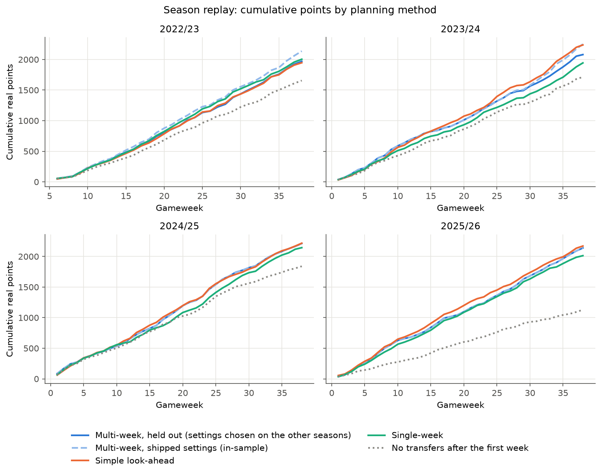

# Validation

Two questions are tested on past seasons:

1. Are the predictions accurate? Tested by a **walk-forward backtest**.
2. Does planning five weeks ahead earn more real points than planning one week at a time? Tested by a **season
   replay**, with the settings validated **leave-one-season-out**.

The data are four past seasons, 2022/23 to 2025/26, from a public archive of FPL's per-match player data
(vaastav/Fantasy-Premier-League). The first five gameweeks of 2022/23 are used only as history to predict from,
because the archive has no earlier season. The true test of both questions is the live 2026/27 season (last
section).

## Walk-forward backtest (predictions)

For every past gameweek, the model is given only the matches that kicked off before that gameweek's first kickoff
(no match is played between the deadline and that kickoff),
predicts the next five gameweeks, and is scored against what actually happened. Nothing from the future can leak
in: every feature is computed from matches before the cutoff, and a test checks that appending made-up future
matches changes no prediction. Gameweeks are never split randomly into training and test sets, because that would
let a model learn from weeks after the ones it is predicting.

The benchmark is rebuilt FPL form: points per match over the last 30 days, rebuilt at every past deadline. FPL's own
`ep_next` forecast equals `form` for most players, so this stands in for FPL's pre-deadline method. Results by horizon, calibration, and the one
held-out prediction result (2025/26, from Stage 3a) are on the [prediction model](prediction-model.md#accuracy)
page. In short: across all four seasons the model beats form at every horizon from one to five gameweeks ahead, on
both error and ranking, but those figures are in-sample because the same seasons were used to tune it.

## Season replay (planning)

The replay plays each past season as a simulated manager would:

- Gameweek 1 (gameweek 6 in 2022/23): pick a squad from scratch with £100m.
- Every gameweek after that: predict the next five gameweeks from matches before the gameweek's first kickoff only; solve the
  optimiser; carry out week one's transfers; score the team on real points; carry the squad, bank, free transfers
  and each player's purchase price forward.
- **Scoring follows FPL**: if a starter does not play, the first bench player who did comes on, keeping a valid
  formation (a goalkeeper only for a goalkeeper); if the captain does not play, the vice-captain's points are
  doubled instead. Hits cost 4 points each.
- **Prices**: players are bought at the archive's price for that gameweek and sold at FPL's selling price (half of
  any rise, rounded down). The archive's price is recorded per match, so it can differ from the price at the
  deadline by a daily price change.
- A player who leaves the league stays in the squad scoring zero until sold at his last price.
- Every replayed plan is re-checked by the independent validator; an illegal plan stops the run.

What the replay does **not** do:

- **Chips are not played**, so the totals leave out whatever chips would add.
- **Prices are frozen within each plan**: the optimiser plans five weeks at today's prices; the real price changes
  only take effect at the next re-plan.
- **The final fixture list is used**, so the replay sees double gameweeks earlier than they were announced. This
  flatters a multi-week planner more than a single-week one, which is why results are also reported for gameweeks
  free of doubles and blanks.

In all, 146 gameweeks are replayed (32 in 2022/23, 38 in each later season). Every policy uses the same predictions,
so the comparison isolates the planning method.

### Policies compared

- **Single-week**: the optimiser planning one week at a time (the Stage 2 model),
  with each free transfer saved for next week valued at 1.5 points.
- **Simple look-ahead**: the same one-week solve, fed each player's discounted five-week total
  (`p1 + 0.85 p2 + 0.85^2 p3 + ...`) instead of next week's points. Untuned.
- **Multi-week**: the five-week model described on the [optimiser](optimiser.md) page, at several settings.
- **No transfers**: the gameweek-1 squad kept all season, as a floor.

### Leave-one-season-out

The multi-week settings (discount, horizon, bench weight, strength of the leftover-transfer table, and hits) were
tuned to maximise total real points over the four seasons. Tuning and scoring on the same seasons overstates how
well the chosen settings will do in a new season. Leave-one-season-out reduces that: each season in turn is scored
with the settings that did best on the **other three**, and the four held-out scores are added up.

Its limits, stated plainly:

- **Not fully held out.** The list of candidate settings was produced by a tuning run over all four seasons, and the
  leftover-transfer table was measured on all four, so the held-out seasons did influence what was on offer.
- **Few, dependent data points.** About 150 gameweeks, each depending on the squad carried from the one before, so
  intervals are wide and a real gain of a point or two a week may not be separable from noise.
- **The clean subset is unbalanced.** Only 52 replayed gameweeks have no double or blank gameweek in the next five,
  and 41 of those are from 2024/25 and 2025/26.
- **Gameweeks are resampled as independent.** The 95% intervals below come from re-sampling gameweeks with
  replacement (a bootstrap), pooled across seasons. That treats gameweeks as independent, which the carried-over
  squad makes only approximately true.
- **The predictions were tuned on the same four seasons**, which makes absolute totals optimistic. This affects
  every policy alike.

## Results

**Points per gameweek, held-out multi-week minus single-week** (a 95% interval is the range of plausible values for
the true difference; one that includes zero means the replay cannot rule out no difference):

| Gameweeks | Difference | 95% interval |
|---|---|---|
| All 146 | +2.03 | -0.10 to +4.33 |
| 52 with no double or blank in the next five | +2.54 | -1.12 to +6.87 |

Both intervals include zero, narrowly in the first case. A moving-block bootstrap with blocks of 1, 3, 5 and 8
gameweeks, run on the saved results by the final reviewer, leaves every conclusion unchanged: the held-out
comparisons still include zero and the simple look-ahead's gain over single-week keeps a positive lower bound.

**Season totals** (real points, no chips):

| Policy | 2022/23 | 2023/24 | 2024/25 | 2025/26 | Total |
|---|---|---|---|---|---|
| No transfers | 1,656 | 1,714 | 1,840 | 1,129 | 6,339 |
| Single-week | 2,004 | 1,944 | 2,144 | 2,013 | 8,105 |
| Simple look-ahead | 1,947 | 2,238 | 2,217 | 2,171 | 8,573 |
| Multi-week, held out (settings chosen on the other three seasons) | 1,970 | 2,080 | 2,213 | 2,139 | 8,402 |
| Multi-week, shipped settings (in-sample) | 2,137 | 2,251 | 2,213 | 2,139 | 8,740 |

The held-out folds chose discount 0.7 for 2023/24, 2024/25 and 2025/26 and 1.0 for 2022/23; 2023/24's fold chose
the leftover table at half strength, the others at full strength. All folds chose horizon 5, bench weight 0.1 and
up to two hits a week.

**Other comparisons**, points per gameweek over all 146 gameweeks, with 95% intervals:

| Comparison | Difference | 95% interval |
|---|---|---|
| Simple look-ahead minus single-week | +3.21 | +0.55 to +5.99 |
| Held-out multi-week minus simple look-ahead | -1.17 | -3.37 to +1.09 |
| Shipped multi-week (in-sample) minus simple look-ahead | +1.14 | -1.21 to +3.44 |
| Shipped multi-week (in-sample) minus single-week | +4.35 | +2.19 to +6.99 |

The chart shows, per season, the multi-week model both held out (the settings leave-one-season-out chose for that
season) and with the shipped settings, which were chosen on all four seasons and so are in-sample.



### Every setting tried

Total real points over the four seasons for every look-ahead setting replayed. Unless stated, multi-week rows use
horizon 5, discount 0.7, bench weight 0.1, the leftover table at full strength and up to two hits a week.

| Setting | Total |
|---|---|
| Multi-week, shipped settings | 8,740 |
| Bench weight 0.2 | 8,708 |
| No hits allowed | 8,661 |
| Discount 1.0 | 8,656 |
| Horizon 3 | 8,644 |
| Leftover table at half strength | 8,635 |
| Bench weight 0.05 | 8,625 |
| Discount 0.8 | 8,577 |
| Simple look-ahead (discount 0.85, horizon 5) | 8,573 |
| Bench weight 0.3 | 8,482 |
| Discount 0.9 | 8,470 |
| Leftover table at zero | 8,443 |
| Horizon 4 | 8,439 |
| *Single-week, for reference* | *8,105* |

## Conclusions

- **Looking ahead helps.** Every one of the 13 look-ahead settings scored more than single-week planning over the
  four seasons, and the gain is about 2 to 3 points a gameweek: +2.03 held out (interval just including zero) and
  +3.21 for the simple look-ahead (interval excluding zero).
- **The full multi-week model and the simple look-ahead are not distinguishable in four seasons of replay.** Held
  out, the multi-week model scored 1.17 points a gameweek less than the simple version; with the in-sample best
  settings it scored 1.14 more. Both intervals include zero.
- **Differences between settings are within the replay's noise.** Totals ranged from 8,439 to 8,740 with no
  consistent order by discount or horizon: discount 1.0 scored more than 0.8, and horizon 4 scored less than both 3
  and 5. The shipped settings are the best estimate from this replay, not a proven optimum.
- **Hits and the measured leftover table showed a consistent direction.** Banning hits scored 8,661 against 8,740
  with up to two a week allowed. Hit margins (an extra penalty per hit) were not tried, because allowing hits already
  beat banning them (8,740 against 8,661). The leftover table scored 8,443 at zero
  strength, 8,635 at half and 8,740 at full, and three of the four held-out folds chose full strength.
- **The true test is the live 2026/27 season.**

## Forward test: 2026/27

The live season is untouched by any tuning. Every live run before a deadline records the model's predictions
(`prediction_log`) next to FPL's own published forecast, `ep_next` (`ep_next_log`). As gameweeks are played, the
model is scored against FPL's real pre-deadline forecast, including injury news the backtest never had. Each
optimiser run for a team before a deadline also records its recommendation (`plan_log`: transfers, captain,
projected points and the settings used, keeping the latest record per gameweek and team), giving a record of what
the multi-week plan advised. The log holds projected points only; scoring the advice needs the actual points joined
in later.

## Reproducing

```bash
python -m ingestion.archive          # past-season archive
python -m prediction.backtest --seasons 2022-23,2023-24,2024-25,2025-26 --models form,component \
    --params prediction/model_params.json --no-decision --splits
python -m evaluation.tune --workers 16   # season replay, tuning and leave-one-season-out (hours)
python scripts/make_charts.py            # redraw the charts on these pages
```

`evaluation.tune` writes `replay_results.parquet`, `leftover_table.json`, `replay_report.txt` and `plan_params.json`
to `data/processed/`; pass `--fresh` after any change to code or data. The replay always uses the shipped
prediction parameters (`prediction/model_params.json`), even where a local re-tune in
`data/processed/model_params.json` exists and the live command line would prefer it.
